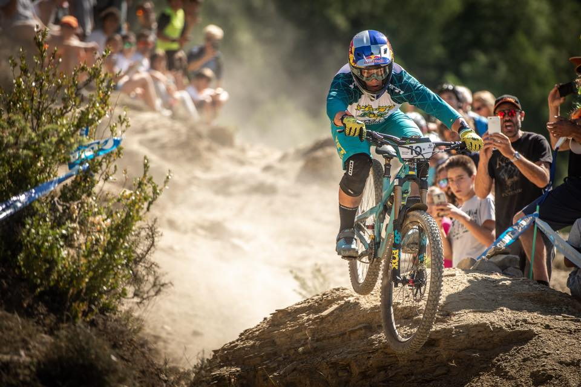

# MTB Coaching App

This is my Level 3 NCEA project for Digital Technologies

It is a database-driven web app that allows users to:

- Register an account
- Login / out
- Browse MTB courses
- Make a booking for a course

## Documentation

The following documents support this project:

- [Design & Review](Design.md)
- [Development & Testing](Development.md)

